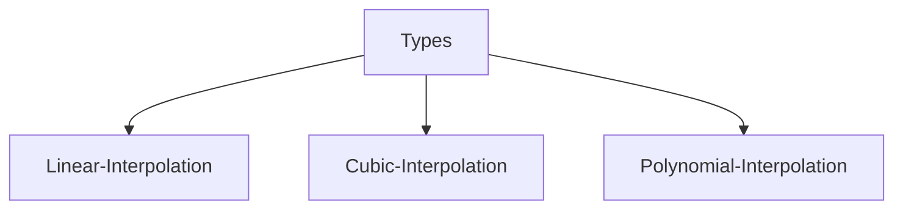

# Feature Engineering Concepts

---

[](https://www.notion.so/1dd9a3a6132180ed89ffd9408a7098cd?pvs=21) 

---

# 01. AI vs ML vs DL vs DS

---

### **1. AI (Artificial Intelligence)**

- **Definition:** The broadest concept — AI is creating machines or systems that can perform tasks that typically require human intelligence.
- **Examples:** Speech recognition (Siri, Alexa), game playing (Chess, Go), recommendation systems.

---

### **2. ML (Machine Learning)**

- **Definition:** A **subset of AI**. ML refers to systems that can **learn from data** and **improve over time** without being explicitly programmed for every rule.
- **Examples:** Spam email detection, image recognition, and fraud detection.

---

### **3. DL (Deep Learning)**

- **Definition:** A **subset of ML**. It uses **neural networks with many layers** (hence “deep”) to model complex patterns in large data.
- **Examples:** Self-driving cars (vision systems), voice assistants, and facial recognition.

---

### **4. DS (Data Science)**

- **Definition:** A broader discipline that combines **statistics, data analysis, and domain expertise** to extract insights from data. Data Science often uses ML and DL as tools.
- **Examples:** Business intelligence, data-driven decision making, predictive analytics.

---

### **In Venn Diagram Form:**

```
         +--------------------+
         |      AI            |
         |  +-------------+   |
         |  |   ML        |   |
         |  |  +-------+  |   |
         |  |  |  DL   |  |   |
         |  |  +-------+  |   |
         |  +-------------+   |
         +--------------------+
  (DS overlaps with all — acts like an umbrella toolset)

```

---

### Real World analogy:

- **AI** = Goal (simulate intelligence)
- **ML** = Approach (learn from data)
- **DL** = Technique (neural networks)
- **DS** = Practice (extract insights from data using stats/ML)

Want a fun analogy or real-world example to help it stick?

# 02. Supervised, Unsupervised, and Reinforcement learning

---

## **1. Supervised Learning**

> "Learn from labeled examples."
> 

### 🔹 How it works:

- The algorithm is trained on a **labeled dataset**, meaning each input has a correct output.
- The model learns to map inputs to outputs.

### 🧠 Think of it like:

A student learning with an answer key.

### 📦 Examples:

- **Spam detection** (email → spam or not spam)
- **Predicting house prices** (input: size, location → output: price)
- **Image classification** (picture of animal → label: cat/dog/etc)

### 📊 Types:

- **Regression** (predict continuous values)
- **Classification** (predict categories)

---

## **2. Unsupervised Learning**

> "Find hidden patterns in unlabeled data"
> 

### 🔹 How it works:

- No labeled outputs; the model finds **structure** or **patterns** in the data.

### 🧠 Think of it like:

An explorer groups similar things without knowing what they are.

### 📦 Examples:

- **Customer segmentation** (grouping customers by behavior)
- **Anomaly detection** (fraud detection, manufacturing defects)
- **Topic modeling** (finding topics in large documents)

### 📊 Types:

- **Clustering** (e.g., K-means)
- **Dimensionality reduction** (e.g., PCA, t-SNE)

---

## **3. Reinforcement Learning**

> "Learn by trial and error with rewards."
> 

### 🔹 How it works:

- An **agent** interacts with an **environment** and learns to make decisions by receiving **rewards** or **penalties**.
- Goal: maximize total reward over time.

### 🧠 Think of it like:

Training a dog with treats — good actions get rewards, bad actions don’t.

### 📦 Examples:

- **Game playing** (like AlphaGo, Dota bots)
- **Robotics** (learning to walk, grip)
- **Self-driving cars** (learning to navigate safely)

---

### Table:

| Type | Data Used | Goal | Example |
| --- | --- | --- | --- |
| **Supervised** | Labeled data | Predict known outcomes | Email spam detection |
| **Unsupervised** | Unlabeled data | Find patterns or groupings. | Customer segmentation |
| **Reinforcement** | Trial & error | Learn optimal actions over time. | AI playing chess or driving cars. |

---

Want a visual analogy or mini real-world story to help you remember these?

# 03. Train, Test, and Validation

---

## 🔧 **1. Training Set**

> "Where learning happens."
> 
- This is the **data the model learns from**.
- It contains both inputs and correct outputs (in supervised learning).
- The model adjusts its internal parameters (like weights in a neural network) to minimize error on this set.

### 🔁 Think of it like:

Studying from a textbook.

---

## 🔍 **2. Validation Set**

> "Where tuning happens."
> 
- Used to **tune hyperparameters** (like learning rate, number of layers, etc.).
- Helps **prevent overfitting** by testing the model on unseen (but still known) data during training.
- The model doesn’t learn from this set — it’s only evaluated on it.

### 🧪 Think of it like:

Taking practice tests while studying to see what works best.

---

## 🧾 **3. Test Set**

> "Where final evaluation happens."
> 
- Completely **held-out data** — the model has never seen it before.
- Used **only once** after training and tuning, to see how well the model generalizes to **new, real-world data**.
- It should be untouched during the training process.

### 🎓 Think of it like:

Your final exam — no more learning, just show what you know.

---

## 🧠 Why this 3-way split?

- **Training set**: to **learn** patterns
- **Validation set**: to **tune** the model and **avoid overfitting**
- **Test set**: to **evaluate** real-world performance

---

## 📊 Typical Splits:

| Dataset | % of Total Data |
| --- | --- |
| Training | 60–70% |
| Validation | 10–20% |
| Test | 20% |

*(Sometimes people use just train/test and do cross-validation instead of a separate validation set.)*

---

## 🛠️ Bonus: Cross-Validation (CV)

Instead of having a fixed validation set, you:

- Split the data into *k* parts (e.g., 5)
- Train on 4 parts, validate on 1 — repeat 5 times.
- Average the results

→ Great when you have limited data!

---

Let me know if you want a simple diagram to visualize this or a real-life analogy to lock it in!

# 04. Bias, Variance, Overfitting, and Underfitting

---

## 🔁 Bias vs. Variance

### 🔷 **Bias**

> Error from wrong assumptions in the learning algorithm.
> 
- A high-bias model is **too simple**, missing patterns in the data.
- It doesn't learn enough — **underfits**.

📉 **High bias = Low performance on both training & test data**

**Examples:**

- Using a linear model to fit complex, non-linear data
- Assuming all emails with “free” are spam (too general)

---

### 🔶 **Variance**

> Error from model sensitivity to small fluctuations in training data.
> 
- A high-variance model is **too complex**, learns noise as if it were signal.
- It memorizes the data — **overfits**.

📉 **High variance = Great on training, bad on test data**

**Examples:**

- Very deep decision trees
- Neural networks with no regularization

---

## 🎭 Overfitting vs. Underfitting

| Concept | Description | Cause | Looks Like |
| --- | --- | --- | --- |
| **Overfitting** | The model fits the training data **too well**, including noise. | **High variance** | Low train error, high test error |
| **Underfitting** | The model can’t capture the underlying pattern. | **High bias** | High error on both sets |

---

### 📈 Visualization (Mental Image)

Imagine fitting curves to a scatter plot:

- **Underfitting**: Just a straight line — misses all the curves.
- **Good Fit**: A nice smooth curve that follows the trend.
- **Overfitting**: A crazy zig-zag line — hits every point exactly, even outliers.

---

## ⚖️ The Tradeoff

You want to balance bias and variance to **minimize total error**:

📉 **Total Error = Bias² + Variance + Irreducible Error**

---

## 🛠️ Solutions:

| Problem | Fixes |
| --- | --- |
| **Underfitting** | Use a more complex model, and add features. |
| **Overfitting** | Use regularization, simplify the model, use more data, and cross-validation. |

---

## TL;DR

- **Bias** = too simple → underfit
- **Variance** = too complex → overfit
- **Good model** = low bias, low variance
- The goal: just the right complexity for your data 🍌

---

Want a goofy analogy or a cartoon-style sketch of this? Happy to make it fun!

# 05. Handling Missing Values

---

## 🔍 First: Identify Missing Values

Check for:

- `NaN` (Not a Number)
- Blank cells
- Placeholders like `'?'`, `'NA'`, `'None'`, or `999`

In **Python/pandas**:

```python
df.isnull().sum()

```

---

## ✅ Common Techniques to Handle Missing Data

### 1. **Remove Data**

### 🔹 a. Drop Rows

- If only a few rows are missing values.

```python
df.dropna(inplace=True)

```

### 🔹 b. Drop Columns

- If a column has **too many missing values** (e.g.,>50%).

```python
df.drop(columns=['column_name'], inplace=True)

```

---

### 2. **Impute (Fill In) Missing Values**

> Better than dropping — retains data and structure.
> 

### 🔹 a. **Mean / Median / Mode**

- **Numerical features**: use **mean** or **median**
- **Categorical features**: use **mode**

```python
df['age'].fillna(df['age'].mean(), inplace=True)
df['gender'].fillna(df['gender'].mode()[0], inplace=True)

```

### 🔹 b. **Forward Fill / Backward Fill**

- Use the previous or next value in the column (good for time series)

```python
df.fillna(method='ffill', inplace=True)  # Forward fill
df.fillna(method='bfill', inplace=True)  # Backward fill

```

### 🔹 c. **Predictive Imputation**

- Use a **machine learning model** (like KNN or regression) to predict missing values based on other features.

---

### 3. **Flag Missingness**

- Add a new binary column indicating where values were missing.

```python
df['age_missing'] = df['age'].isnull().astype(int)

```

Useful if "missingness" itself carries information (e.g., missing income could signal something meaningful).

---

### 4. **Use Models That Handle Missing Data**

- Some algorithms can **natively handle missing values**, like:
    - XGBoost
    - LightGBM
    - CatBoost

---

## ⚠️ Things to Watch Out For

- **Don’t leak test data into imputation** (do it only with training data).
- Always compare performance **before and after** imputation.
- Use **domain knowledge** when possible (e.g., fill “Blood Type” with “Unknown”, not the mode).

---

## TL;DR Table:

| Method | Best for | Risk |
| --- | --- | --- |
| Drop rows/columns | Sparse missing data | Lose data |
| Mean/Median/Mode | Simple numeric/categorical | May bias distribution |
| Ffill/Bfill | Time series data | Assumes trend continuity |
| Predictive impute | Complex, structured datasets | Time-consuming |
| Missing flags | When missing is informative. | Adds new features |

---

# 06. Handling Imbalanced Datasets

---

## 6.1 Upscaling and Downscaling:

### ⚖️ **Imbalanced Datasets**

- A dataset where one class (the **majority**) has **many more samples** than the other class (the **minority**).
- Common in areas like fraud detection, medical diagnosis, and churn prediction.

---

### 🔁 **Rescaling in Imbalanced Datasets**

In this context, **rescaling** often refers to **resampling**, which includes:

---

### 🔼 **Upscaling / Oversampling**

- **Increases** the number of samples in the **minority class**.
- Goal: balance the class distribution by **adding more minority samples**.

### 🧪 Techniques:

1. **Random Oversampling**
    - Randomly duplicates samples from the minority class.
    - Simple but may cause **overfitting**.
2. **SMOTE (Synthetic Minority Over-sampling Technique)**
    - Generates **synthetic samples** based on existing ones using interpolation.
    - Helps avoid overfitting compared to random oversampling.
3. **ADASYN**
    - Like SMOTE, but focuses more on **harder-to-learn** samples.

---

### 🔽 **Downscaling / Undersampling**

- **Reduces** the number of samples in the **majority class**.
- Goal: balance the dataset by **removing some majority samples**.

### 🧪 Techniques:

1. **Random Undersampling**
    - Randomly drops samples from the majority class.
    - Fast and easy, but may **lose important data**.
2. **Tomek Links / Edited Nearest Neighbors**
    - Removes ambiguous or borderline majority samples.
    - Aims to clean class boundaries rather than just drop samples.

---

### ⚖️ **When to Use What?**

| Scenario | Technique | Pros | Cons |
| --- | --- | --- | --- |
| Small dataset | **Oversampling** | Keeps all data, adds more | Risk of overfitting |
| Large dataset | **Undersampling** | Reduces training time | Risk of information loss |
| Complex boundary | **SMOTE / ADASYN** | Creates balanced, diverse data | Needs careful tuning |

---

### 🛠️ Python Example (imbalanced-learn)

```python
from imblearn.over_sampling import SMOTE
from imblearn.under_sampling import RandomUnderSampler

# Upsampling
X_up, y_up = SMOTE().fit_resample(X, y)

# Downsampling
X_down, y_down = RandomUnderSampler().fit_resample(X, y)

```

---

### 🧪 Example with `resample` (from `sklearn`)

### 📚 Setup: Simulate an Imbalanced Dataset

```python
import numpy as np,
import pandas as pd, from sklearn.utils import resample

# Create a simple imbalanced dataset
data = {
    'feature': np.random.randn(100),
    'target': [0]*90 + [1]*10  # Class 0 = majority, Class 1 = minority
}

df = pd.DataFrame(data)

# Split majority and minority
df_majority = df[df['target'] == 0]
df_minority = df[df['target'] == 1]

```

---

### 🔼 Upsampling (Minority Class)

```python
# Upsample minority class
df_minority_upsampled = resample(
    df_minority,
    replace=True,       # sample with replacement
    n_samples=90,       # match the number of the majority class
    random_state=42     # reproducibility
)

# Combine majority and upsampled minority
df_upsampled = pd.concat([df_majority, df_minority_upsampled])

print(df_upsampled['target'].value_counts())

```

✅ Now both classes have **90 samples** each — balanced.

---

### 🔽 Downsampling (Majority Class)

```python
# Downsample the majority class
df_majority_downsampled = resample(
    df_majority,
    replace=False,      # sample without replacement
    n_samples=10,       # match the number of minority class
    random_state=42
)

# Combine downsampled majority and minority
df_downsampled = pd.concat([df_majority_downsampled, df_minority])

print(df_downsampled['target'].value_counts())

```

✅ Now both classes have **10 samples** each — balanced but with less data.

---

### ⚠️ Notes

- Use **upsampling** when you want to preserve all data and add synthetic or duplicate samples.
- Use **downsampling** when your dataset is large and you're okay with losing some data for balance.

Let me know if you want this adapted for a real dataset like `sklearn.datasets.make_classification` or with SMOTE!

## 6.2 SMOTE(**Synthetic Minority Over-sampling Technique)**

[https://github.com/anuj-kumar-30/ML_pw.git](https://github.com/anuj-kumar-30/ML_pw.git)

[https://github.com/anuj-kumar-30/ML_pw/tree/7b8dbe17dca1b698612d073208849ae1ef6e6d14/ML19_ML_Concepts](https://github.com/anuj-kumar-30/ML_pw/tree/7b8dbe17dca1b698612d073208849ae1ef6e6d14/ML19_ML_Concepts)

### 📌 **What is SMOTE?**

- **SMOTE** is a technique used to handle **class imbalance** in datasets, particularly in classification tasks.
- It **generates synthetic samples** of the minority class to balance the dataset, instead of simply duplicating existing samples.

---

### ⚙️ **How Does SMOTE Work?**

1. **Identify minority class samples**.
2. For each sample:
    - Find its **k-nearest neighbors** (usually `k=5`) within the minority class.
3. Randomly select one or more of these neighbors.
4. Create a synthetic sample:
    - Choose a point on the line between the original sample and the neighbor:
        
        Synthetic point=x+δ⋅(xneighbor−x)\text{Synthetic point} = x + \delta \cdot (x_{\text{neighbor}} - x)
        
        where δ\delta is a random number in [0,1][0, 1].
        

---

### ✅ **Advantages**

- Reduces overfitting compared to simple oversampling (replication).
- Improves classifier performance for imbalanced datasets.
- Can be used with various classifiers (SVM, Random Forest, etc.).

---

### ⚠️ **Disadvantages / Limitations**

- May create **ambiguous samples** near class boundaries.
- It can increase the chance of **overlapping** between classes.
- Doesn’t take into account the **majority class distribution**, which can be problematic.

---

### 🛠️ **Variants of SMOTE**

- **Borderline-SMOTE**: Focuses on samples near the decision boundary.
- **SMOTE-NC**: Handles mixed data types (numerical + categorical).
- **ADASYN**: Generates more synthetic data in regions where the minority class is harder to learn.

---

### 📚 **Use in Python (with imbalanced-learn)**

```python
From imblearn.over_sampling import SMOTE

sm = SMOTE(random_state=42)
X_resampled, y_resampled = sm.fit_resample(X, y)

```

---

Let me know if you'd like diagrams, examples, or comparisons with other techniques like undersampling or ensemble methods.

## 6.3 Data Interpolation

> It is the process of estimating unknown values within a dataset based on the known values. In Python, there are various libraries available that can be used for data interpolation, such as numpy, scipy, and pandas**.**
> 



### 🔧 What is Linear Interpolation in ML?

In machine learning, **linear interpolation** is used to estimate or predict intermediate values between two known data points, assuming a linear relationship between them. It’s not a learning algorithm per se, but it’s often used in:

1. **Data preprocessing**
2. **Model interpretability**
3. **Feature engineering**
4. **Imputation (filling in missing values)**

```python
# import libraries
import numpy as np
import matplotlib.pyplot as plt
import pandas as pd

# Creating linear sample data where x=2y
x = np.array([1,2,3,4,5])
y = np.array([2,4,6,8,10])

# Plot a graph that is going to be a linear line
plt.scatter(x, y)

# Now we will apply Linear interpolation to increase our value counts
x_new = np.linspace(1,5,10) # creating new x values
y_interp = np.interp(x_new, x, y) # generating new y values based on the relationship between x and y

# Plot a graph which also going to be same as the previous one
plt.scatter(x_new, y_interp)
```

### 🔍 What is Cubic Interpolation?

While **linear interpolation** connects two points with a straight line, **cubic interpolation** fits a **smooth curve** (a **cubic polynomial**) through several points. This curve is defined by an equation of the form:

y = ax^3 + bx^2 + cx + d

It uses **4 known data points** to estimate unknown values, which allows for **smoother transitions** and better modeling of curved data trends, especially useful when the data isn’t linear.

```python
x = np.array([1,2,3,4,5])
y = np.array([1,8,27,64,125])
plt.scatter(x,y)

from scipy.interpolate import interp1d

# Create a cubic interpolation function
f=interp1d(x,y,kind='cubic')

# Interpolate the data
x_new = np.linspace(1,5,10)
y_interp = f(x_new)
y_interp

plt.scatter(x_new, y_interp)
```

## 🔍 What Is Polynomial Interpolation?

**Polynomial interpolation** is the process of estimating a function that passes through a given set of data points using a **single polynomial of degree n**.

```python
# create some sample data
x = np.array([1,2,3,4,5])
y = np.array([1,4,9,16,25])

# Interpolate the data using polynomial interpolation
p = np.polyfit(x, y, 2) # interpolate y values

x_new = np.linspace(1,5,15)
y_interp = np.polyval(p, x_new) 

plt.scatter(x,y)

plt.scatter(x_new, y_interp)
```

> In simple Outliers are those data points that are completely different or out of range from the majority of the dataset are called outliers
> 

Why do we need to take care of these outliers?

> Having outliers in our datasets can drastically affect our model during the training process.
> 

## 7.2 How to Handle Outliers

- 1st, we need to understand the 5 numbers summary:
    1. Min value
    2. Q1 - 25 percentile
    3. Median
    4. Q3-75 percentile
    5. Max value
- Syntax:
    - `np.percentile(list/series, percentile)`

```python
import numpy as np
marks = [20,50,55,23,26,258,111000,100]

# finding 5 number value in marks
# syntax: np.percentile(list/series, percentile)
print(f'Min_value: {np.percentile(marks, 0)}\nQ1: {np.percentile(marks, 25)}\nQ2: {np.percentile(marks, 50)}\nQ3: {np.percentile(marks, 75)}\nMax_value: {np.percentile(marks, 100)}')
```

### Method: 01(Using formulas)

- To find the outliers, we will create a range [lower_fence, higher_fence] if the element is outside this range is called an outlier.
- To calculate lower_fence and higher_fence, 1st we will find the quartile value for the series.
    1. `np.quantile(lst_marks, [0.0,0.25,0.50,0.75,1.0])`
    2. IQR(Inter Quartile Range) = `Q3 -Q1`
    3. lower_fence = `Q1 - 1.5*IQR`
    4. Higher_fence = `Q3 + 1.5*IQR`
- Now anything outside this range are the outliers in the list or series.

```python
# finding all 5 quartile
mn, q1, q2, q3, mx = np.quantile(marks, [0.0,0.25,0.50,0.75,1.0])
mn, q1, q2, q3, mx

# calculating lower fence and higher fence
IQR = q3-q1
lf = q1 - 1.5*IQR
hf = q3 + 1.5*IQR

# check if number is a outlier or not
for mark in marks:
    if (mark<lf or mark>hf):
        print(f'{mark} this is a outlier')
```

### Method: 02(Using Box Plot)

- 1st create box plot using sns. `sns.boxplot(marks)`
- Now anything outside this box is an outliers.

```python
import seaborn as sns
sns.boxplot(marks)
```

# 08. Feature Extraction

> It is the process of selecting and extracting the most important features from raw data
> 

## 8.1 Feature Scaling

> It is the process of normalizing or standardizing the range of independent variable(features) in our datasets
> 

> This is important because many machine learning algorithms perform **better or converge faster** when features are on a **similar scale**.
> 

### 8.1.1 Why do we need Feature scaling

- Many ML models are sensitive to **feature magnitudes**, such as:

| Algorithm | Needs Scaling? | Why? |
| --- | --- | --- |
| Linear Regression | ✅ | Assumes equally weighted features |
| Logistic Regression | ✅ | Gradient descent convergence |
| SVM | ✅ | Distance-based (dot product) |
| KNN | ✅ | Based on Euclidean distance |
| Neural Networks | ✅ | Faster gradient descent |
| Tree-based (e.g., Random Forest, XGBoost) | ❌ | Not sensitive to feature scale |

### 8.1.2 Common Feature Scaling Methods

1. Min-Max Scaling(Normalization)
- Scales features to [0, 1]
- Good for: image pixel values, neural nets

```python
from sklearn.preprocessing import MinMaxScaler

scaler = MinMaxScaler()
scaled = scaler.fit_transform(X)
```

$$
x_{scaled} = \frac{x - x_{min}}{x_{max} - x_{min}}

$$

b. Standardization (Z-score Normalization)

- Centers data around 0 with unit variance
- Good for: algorithms assuming Gaussian distribution

```python
from sklearn.preprocessing import StandardScaler

scaler = StandardScaler()
scaled = scaler.fit_transform(X)
```

$$
z = \frac{x - \mu}{\sigma}
$$

c. Robust Scaling

- Uses median and interquartile range
- Good for: datasets with outliers

```python
from sklearn.preprocessing import RobustScaler

scaler = RobustScaler()
scaled = scaler.fit_transform(X)
```

$$
\frac{X - X_{median}}{IQR}
$$

d. MaxAbs Scaling

- Scales data to [-1, 1] based on absolute max.
- Useful for sparse data(eg: TF-IDF vectors)

$$
X' = \frac{X}{|{X_{max}}|}
$$

### Summary

| Method | Use When... | Sensitive to Outliers? |
| --- | --- | --- |
| Min-Max | Bounded input needed (e.g., images) | ✅ Yes |
| Standardization | Features have different units | ✅ Yes |
| Robust | Data has many outliers | ❌ No |
| MaxAbs | Sparse data (e.g., NLP) | ✅ Yes |

## 8.2 Feature Selection

> Here we just pick the most important features.
> 

### 8.2.1 How do we filter the features:

1. Filter Method
2. Embedded Method
- PCA
    
    🧠 What is PCA?
    
    > It is a dimensionality reduction technique.
    It transforms a dataset with many possibly correlated features into a smaller number of uncorrelated features called principle components, while preserving as much variance as possible.
    > 
    
    ✅ Why Use PCA?
    
    > 
    > 
    > 
    > 
    > | Reason | Benefit |
    > | --- | --- |
    > | 🚀 Speed up ML models | Reduces feature space, fewer computations |
    > | 🧹 Reduce noise | Removes less important information |
    > | 📉 Prevent overfitting | Lower dimensional space = fewer chances to overfit |
    > | 📊 Better visualization | Makes high-dimensional data plottable (e.g., in 2D/3D) |
    
    📐 How Does PCA Work?
    
    > 
    > 
    > 1. Standardize the data.
    > 2. Compute Covariance Matrix: This shows how features vary together
    > 3. Calculate Eigenvectors and Eigenvalues.
    >     1. Eigenvectors = new feature directions
    >     2. Eigenvalues = how much variance each direction explains
    > 4. Sort and Select Components.: Choose top k components that explain most variance.
    > 5. Transform Data: Project the data onto those k principle components.
    
    ## ✅ When to Use PCA
    
    - Too many features (especially if they're correlated)
    - You want faster training or visualization
    - You want to reduce noise or overfitting

# 09. Data Encoding

> AIM —> Categorical features —> Numerical —> ML model —> Train
> 

## 9.1 Types of Data encoding

- Nominal/ OHE(One Hot Encoding)
    
    Q. What is Nominal Encoding?
    
    > It is a technique used to transform categorical variables that have no intrinsic ordering into numerical values that can be used in machine learning models. One common method for nominal encoding is one-hot encoding, which creates a binary vector for each category in the variable.
    > 
    
    Limitations:
    
    1. Sparse matrix(overfitting)
    2. It always create n number of columns for the n unique values, which is a problem for our model fitting.
    
    ```python
    # import libraries
    import pandas as pd
    from sklearn.preprocessing import OneHotEncoder
    
    # sample dataframe
    df = pd.DataFrame({'color': ['red', 'blue', 'green', 'red', 'blue']})
    
    # create an instance of OHE
    encoder = OneHotEncoder()
    encoded = encoder.fit_transform(df[['color']])
    
    # converting toarray to dataframe
    pd.DataFrame(encoded.toarray(), columns = encoded.get_features_names_out())
    
    ```
    
- Ordinal and Label Encoding
    
    **LABEL ENCODING:**
    
    - While working with datasets, we often encounter categorical data, which needs to be converted into numerical format for ML algorithms to process.
    - eg: a column representing colors( “red” , “green”, “blue”) is a categorical data for color dataset.
    - One method to achieve this is **LABEL ENCODING.**
    
    > It is a technique that is used to convert categorical columns into numerical ones so that they can be fitted by machine learning models which only take numerical data.
    > 
    
    **Q. How to Preform Label Encoding in Python?**
    
    ```python
    # Importing iris dataset
    import numpy as np
    import pandas as pd
    import seaborn as sns
    
    df = sns.load_dataset('iris')
    df['species'].unique() # list all the unique value
    # output: array(['Iris-setosa', 'Iris-versicolor', 'Iris-virginica'], dtype=object)
    
    # Applying Label Encoding with "LabelEncoder()" so that our categorical value should be replaced with the numerical value[int]
    from sklearn.preprocessing import LabelEncoder
    
    label_encoder = LabelEncoder()
    df['species'] = label_encoder.fit_tranform(df['species'])
    
    df['species'].unique()
    # OUPUT: array([0, 1, 2], dtype=int64)
    
    ```
    
    **ADVANTAGES:**
    
    - Label Encoding works well for **ordinal data,** where the order of categories is meaningful(eg: Low, Medium, High).
    - Straightforward to use, requires less preprocessing because it directly converts each unique category into a numeric value.
    
    **NOTE:** 
    
    - We should never use `LabelEncoder()` because we can not explicitly assign value based on rank in `LabelEncoder()` , which can create a problem when dealing with the ordinal data in ML.
    
    **ORDINAL ENCODER:**
    
    - This encoding is best suited for the ranked data. eg: grade, height etc
    
    **Implementing Ordinal Encoding in Sklearn**
    
    ```python
    # import neccesery libraries
    from sklearn.preprocesssing import OridinalEncoder
    
    # Sample data
    data = {
        'Student': ['Alice', 'Bob', 'Charlie', 'David', 'Eva'],
        'Grade': ['A', 'B', 'C', 'A', 'B']
    }
    df = pd.DataFrame(data)
    
    # applying Ordinal encoding
    ordinal_encoder = OrdinalEncoder(categories=[['A', 'B', 'C']])
    ordinal_encoder.fit_tranform(df[['Grade']])
    ```
    
- Target Guided Ordinal Encoding
    - There are specifically two types of guided encoding techniques for categorical features, namely:
        - Target guided ordinal encoding
        - Mean guided ordinal encoding
    
    **Q. What is target guided encoding technique?**
    
    > In this technique we will take help of our target variable to encode the categorical data
    This encoding technique is useful when we have a categorical variable with large number of unique categories and we want to use this variable as a feature in our ML model.
    In target guided ordinal Encoding, we replace each category in the categorical variable with a numerical value based on the mean or median of the target variable for that category. This creates a monotonic relationship between the categorical variable and the target variable, which can improve the predictive power of our model.
    > 
    
    **LETS TRY TO CODE THIS:**
    
    ```python
    # creating sample dataset
    import pandas as pd
    
    df = pd.DataFrame({'city': ['New York', 'London', 'Paris', 'Tokyo', 'New York', 'Paris'], 'price': [200,150, 300, 250, 180, 320]})
    df.head()
    
    ## calculate the mean price for each city
    dct = df.groupby(['city'])['price'].mean().to_dict()
    
    ## replace each city with its mean price
    df['city_encoded'] = df['city'].map(dct)
    ```
    

# 10. Covariance and Correlation

> Covariance and Correlation are the two key concepts in Statistics that helps up analyze the relationship between two variables.
> 

> Covariance measures how two variables change together, indicating whether they move in the same or opposite directions
> 

## **10.1  What is Covariance?**

> It is a statistics measure that indicates the direction of the linear relationship between two variables.
> 

> It finds the relationship between the feature columns.
> 

$$
\operatorname{Cov}(X,Y) = E[XY] - E[X]E[Y]
$$

- Types:
    - positive covariance: both variable increases, respect to each other
    - Negative covariance: here one variable increases, the other variable tends to decrease.
    - Zero covariance: No linear relationship between two variables.

**Covariance:**

1. It is the relationship between a pair of random variables where a change in one variable causes a change in another variable.
2. It can take any value between **– infinity to +infinity**, where the negative value represents the negative relationship whereas a positive value represents the positive relationship.
3. It is used for the linear relationship between variables.
4. It gives the direction of relationship between variables.

## **10.2 What is Correlation?**

> It is a standardized measure of the strength and direction of the linear relationship between two variables.
> 

> It is derived from covariance and range between -1 to 1.
> 
- **Positive Correlation (close to +1)**: As one variable increases, the other variable also tends to increase.
- **Negative Correlation (close to -1)**: As one variable increases, the other variable tends to decrease.
- **Zero Correlation**: There is no linear relationship between the variables.

### 10.2.1 Pearson Correlation Coefficient

- The more the value towards +1 the +ve correlated (x,y).
- The more the value towards it is -1 the more -ve correlated it is (x,y)

$$
r = \frac{\sum_{i=1}^{n} (x_i - \bar{x})(y_i - \bar{y})}{\sqrt{\sum_{i=1}^{n} (x_i - \bar{x})^2} \sqrt{\sum_{i=1}^{n} (y_i - \bar{y})^2}}
$$

- Here,
    - xi —>  feature value at i
    - x_bar —> mean value of x feature
- `df.corr(method='pearson')` is the syntax to find the prearson correlation.

### 10.2.2 Spearman Rank correlation [-1 to 1]

| X | Y | Rank(x) | Rank(y) |
| --- | --- | --- | --- |
| 1 | 2 | 5 | 5 |
| 3 | 4 | 4 | 4 |
| 5 | 6 | 3 | 3 |
| 7 | 8 | 2 | 1 |
| 0 | 7 | 6 | 2 |
| 8 | 1 | 1 | 6 |
- Here Rank of x is the position of x if the value is sorted in the ascending order.
- `df.corr(method='spearman')`  is the syntax to find the Spearman correlation.

$$
{r_s}={{cov(R_x, R_y)}/{std(R_x) * std(R_y)}}
$$

# Feature Selection Foundation

- It is a important step in ML which involves selecting a subset of relevant features from the original feature set to reduce the feature space while improving the model’s performance by reducing computational power. It’s a critical step in the ML especially when dealing with high-dimensional data.
- There are various algorithms used for feature selection and are grouped into 3 main categories:
    - Filter Methods
    - Wrapper Methods
    - Embedded Methods

## Filter Methods

- Filter methods evaluate each feature independently with target variable.
- Feature with high correlation with target variable are selected as it means this feature has some realtion and can help us in making predictions.

**Advantages:**

- Fast and inexpensive: can quickly evaluate features without training the model.
- Good for removing redundant or correlated features.

**Limitations:**

These methods don’t consider feature interations so they may miss feature combinations that improve model performance.